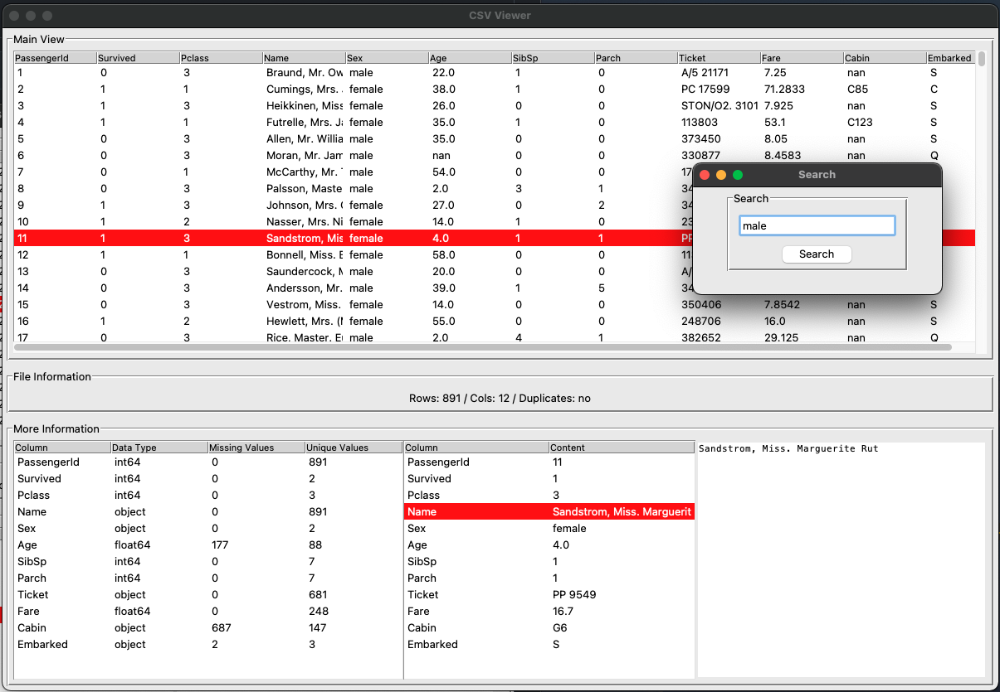

# CSV-Viewer
- Lightweight csv-viewer by Markus Müller



## Description

CSV-Viewer to get all the relevant information at one peak.
- Main view with the wole csv-file
- Infomration about
    - number of rows and columns
    - are there duplicates?
    - data types (pandas DataFrame)
    - missing values
    - extra view of a selected row
    - extra view of a selected item in a row

## Getting Started

### Dependencies

* Python 3.9.2
* tkinter
* numpy
* pandas
* pyperclip3

### Installing

* Make sure you have the dependencies installed and you are good to go

### Executing program

```
python app.py
```

## Authors

Markus Müller
[@MarkusM99098101](https://twitter.com/MarkusM99098101)

## Version History

* 0.1
    * Initial Release

## ToDp

* add seach function

## License

This project is licensed under the [NAME HERE] License - see the LICENSE.md file for details

## Acknowledgments

Inspiration, code snippets, resources, etc.
* https://stackoverflow.com/questions/30614279/python-tkinter-tree-get-selected-item-values/30615520
* https://pythonguides.com/python-tkinter-treeview/)
* https://stackoverflow.com/questions/14824163/how-to-get-the-input-from-the-tkinter-text-widget)
* https://www.geeksforgeeks.org/right-click-menu-using-tkinter/)
* https://www.pythontutorial.net/tkinter/tkinter-window/)
* https://gist.github.com/RamonWill/f5e9fbc9df2bdceaa176448512e16eea